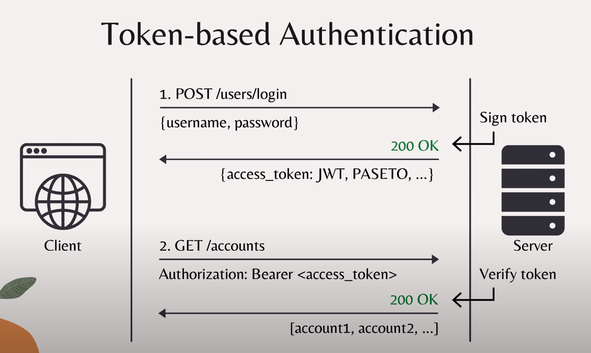
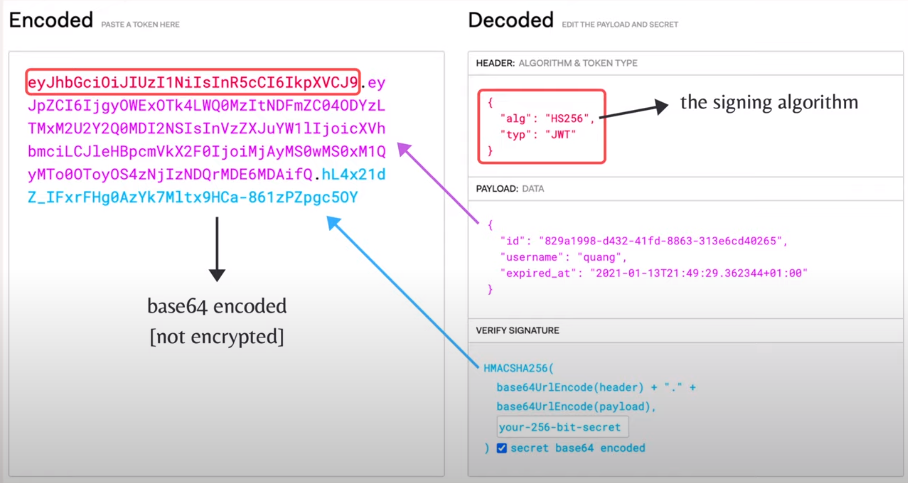

# token的验证机制

- POST 
  - 客户端发送验证信息（账号密码）
  - 服务器注册token
  - 成功后返回一个token
- GET
  - 客户端发送带token的请求
  - 服务器验证token
  - 成功后返回数据
token会过期

# JWT(json web token)

base64 编码是未加密的

## 对称密钥算法
- 使用同一个密钥供双方使用
- 适合本地使用。（密钥可以共享情况下才可以使用）
- HS256,HS384,HS512
  - HS256 = HMAC + SHA256
    - HMAC:(Hashed-base Message Authentication Code) 基于哈希的信息验证编码
    - SHA:(Secure Hash Algorithm) 安全的哈希算法
  - 以上算法不适用于外部服务想要验证令牌的场景
## 非对称算法
- 私钥：令牌签名
- 公钥：令牌验证
- RS256,RS384,RS512 || PS256,PS384,PS512 || ES256,ES384,ES512

## JWT 的问题
- 提供的算法过多，难以挑选
- 有些算法易受攻击
  - RSA PKCSv1.5 易受padding oracle攻击
  - ECDSA: invalid-curve attack

- 易伪造
  - 将header 设置为none可以绕过签名。（有些库修复此问题）
  - 将header 设置成 ”HS256“。对称密钥算法，同时用RSA公钥来验证token。
    - 服务器通常使用"RS256"算法。
    - 应对这种攻击，必须对header进行检查

综上，JWT标准的设计具有缺陷。

# PASETO (Platform-Agnostic SEcurity TOkens)
- 易用，不用选择算法
- 只需要选择版本
- 没有header，就不存在header伪造